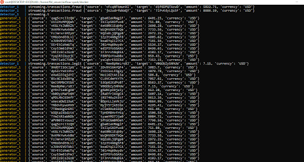

# Mini Project - Kafka

This is a real-time fraud detection system backed by Apache Kafka using a Python client and locally built on Docker.

## Description

This fraud detection system is built using Docker. The system consists of:

* Kafka local cluster: Created as an independent service and composed by a Zookeeper and a Broker.
* Transaction generator: Producer (via Kafka Python's producer API); generates fake transactions and produce to topic *queueing.transactions*
* Fraud detector: Consumer (via Kafka Python's consumer API) + Producer; stream processing application that filters a stream of transactions from topic *queueing.transactions*, performs filtering and outputs the result into two seprate streams: *streaming.transactions.legit* and *streaming.transactions.fraud*

## Getting Started

# Prerequisites

* Install [Docker Desktop][1]

[1]: https://www.docker.com/

## Setup

### Clone project

    $ git clone https://github.com/rafael-roano/25.4_Kafka_Streaming_Fraud_Detection.git

### Build the Generator image:

Inside 25.4_Kafka_Streaming_Fraud_Detection/generator run:

    $ docker build -t rr/generator .

### Build the Detector image:

Inside 25.4_Kafka_Streaming_Fraud_Detection/detector run:

    $ docker build -t rr/detector .

### Start the Kafka cluster Docker container

Inside 25.4_Kafka_Streaming_Fraud_Detection/ run:

    $ docker-compose -f docker-compose-k.yml up

### Start the Generator and Detector app containers

Inside 25.4_Kafka_Streaming_Fraud_Detection/ run:

    $ docker-compose up

## System running

## Authors

Rafael Roano

## Version History

* 0.1
    * Initial Release